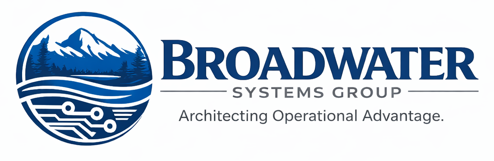

  

  <strong>Architecting Operational Advantage.</strong>

---

### About

Broadwater Systems Group (BSG) is a systems architecture and integration firm based in Townsend, Montana, specializing in managed LoRaWAN monitoring solutions for agriculture, water infrastructure, municipal systems, and rural industry.

We design, deploy, and manage private LoRaWAN networks that give operators real-time visibility into the systems they depend on — water levels, flow rates, soil conditions, equipment status, and environmental data — without per-device cellular costs.

### Platform

Our stack is built on open, proven infrastructure:

| Layer | Technology |
|-------|-----------|
| **Network Server** | ChirpStack v4 (self-hosted) |
| **Client Portal** | React + FastAPI + TimescaleDB |
| **Gateway Hardware** | RAKwireless WisGate Edge series |
| **Sensor Hardware** | Dragino LoRaWAN sensor catalog |
| **Mapping** | Mapbox satellite imagery |
| **Billing** | Stripe integrated subscriptions |
| **Notifications** | Email, SMS, in-app, mobile push |

### Capabilities

- **Network Design & Deployment** — Site surveys, gateway placement, RF coverage planning for valleys, canyons, and open rangeland
- **Sensor Integration** — Custom register map decoders for any LoRaWAN device; bridging existing RS485/Modbus instrumentation via LoRaWAN converters
- **Managed Monitoring** — Multi-tenant dashboards, configurable alert routing, automated SLA reporting
- **White-Label SaaS** — Our portal is available as a white-label platform for other LoRaWAN network operators running ChirpStack

### Verticals

🌾 **Agriculture** — Soil moisture, irrigation scheduling, greenhouse climate, weather stations  
💧 **Water Infrastructure** — Canal levels, reservoir monitoring, flow metering, pump station telemetry  
🏭 **Industrial** — Environmental compliance, process monitoring, equipment health  
🏛️ **Municipal** — Smart metering, water treatment oversight, facility monitoring  
🏫 **Education** — Operational workflow automation, facility systems integration

### Contact

**Joseph Gill** — Systems Architect  
📍 Townsend, Montana  
📧 joe@broadwatersystemsgroup.com  
📞 406.241.2087  
🌐 [broadwatersystemsgroup.com](https://www.broadwatersystemsgroup.com)  
📡 [portal.broadwatersystemsgroup.com](https://portal.broadwatersystemsgroup.com)
